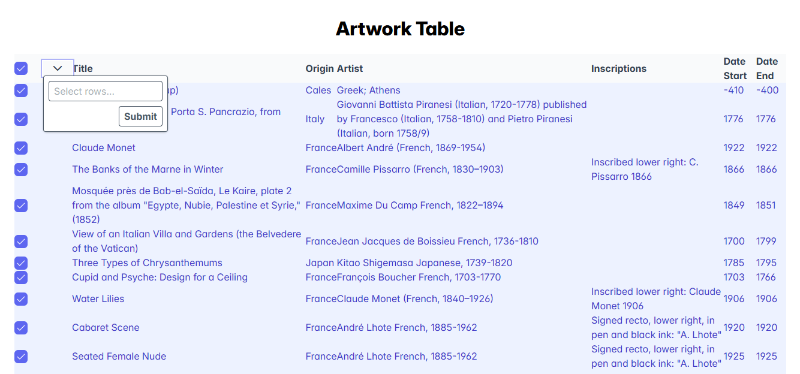
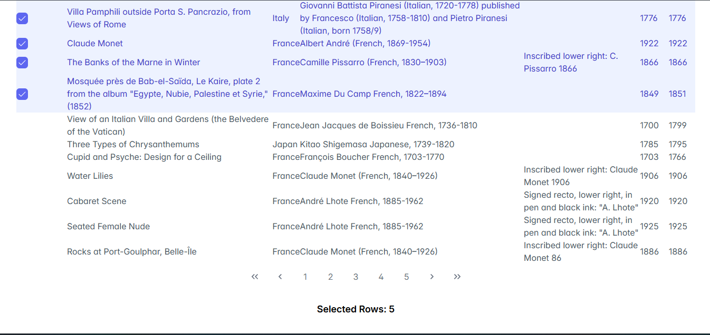
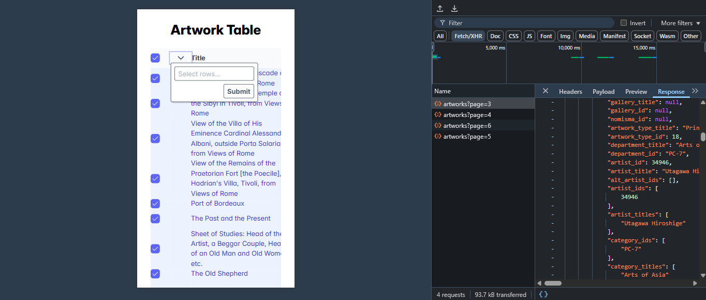

---

```markdown
#  Art Table Viewer

A responsive and interactive React + TypeScript component to fetch, display, and manage artworks using [PrimeReact](https://primereact.org/) DataTable.

##  Features

-  Fetch artworks via API and display in table
-  Checkbox selection for individual and bulk items
-  "Select All" functionality
-  Manual input to select items by ID
-  Pagination with lazy loading
-  OverlayPanel to show selected artwork details
-  Type-safe and ESLint-clean

##  Tech Stack

| Tool             | Purpose                          |
|------------------|----------------------------------|
| React            | Frontend UI                      |
| TypeScript       | Type Safety                      |
| PrimeReact       | UI Component Library             |
| Axios            | API Calls                        |
| Tailwind CSS     | Styling (optional usage)         |

## 📁 Folder Structure

```

src/
├── components/
│   └── ArtTable.tsx   // Main component
├── App.tsx            // App Entry
└── main.tsx           // React DOM render

````

##  Installation

1. Clone the repo  
   ```bash
   git clone https://github.com/raeen-fatima/ReactPrime-Table.git
   cd art-app
  


````

2. Install dependencies

   ```bash
   npm install
   ```

3. Run the app

   ```bash
   npm run dev
   ```

##  Sample API Response

```json

  {
  "id": 12345,
  "title": "Sunset Over the Lake",
  "place_of_origin": "Italy",
  "artist_display": "Giovanni Bellini",
  "inscriptions": "Signature bottom right",
  "date_start": 1475,
  "date_end": 1480
}

```

##  Learning Outcomes

* Working with PrimeReact’s DataTable in a real-world scenario
* Managing complex UI state with React hooks
* Ensuring type safety using TypeScript interfaces
* Implementing reusable, production-grade components

##  Screenshots




##  Credits

Made by [Raeen Fatima](https://github.com/raeen-fatima) — as part of a React internship assignment.

---

